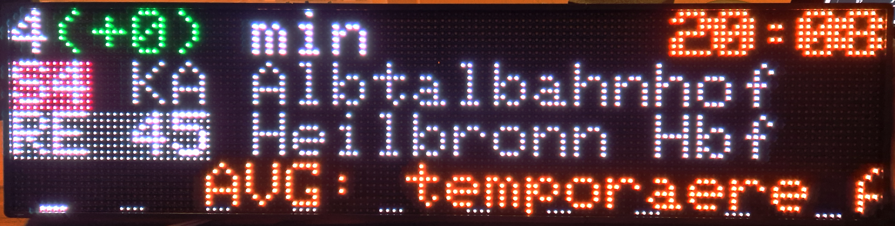
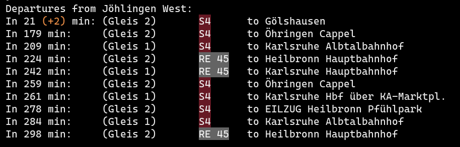

# KVV Departure Board and API Tests

Some KVV (Karlsruher Verkehrs Verbund) "EFA"-API tests for train schedules and information.

> [!IMPORTANT]
> This API doesn't seem like a permanent solution, it could change at any time completely.

## Basic API:

- Searching for a station:

```
https://www.kvv.de/tunnelEfaDirect.php?action=XSLT_STOPFINDER_REQUEST&coordOutputFormat=WGS84[dd.ddddd]&name_sf=<your station name>&outputFormat=JSON&type_sf=any]()
```

- Requesting station departures:

```
https://projekte.kvv-efa.de/sl3-alone/XSLT_DM_REQUEST?outputFormat=JSON&coordOutputFormat=WGS84[dd.ddddd]&depType=stopEvents&locationServerActive=1&mode=direct&name_dm=<your station id>&type_dm=stop&useOnlyStops=1&useRealtime=1&limit=10
```

## ESP32 Departure Board

Based on an ESP32 dev board and two 32x64 px. HUB75 displays



The code can be found in the `./departure-board` subdirectory. 

### Dependencies

- Arduino IDE
- Arduino WiFi & Wifi UDP library
- ESP32 Preferences
- Arduino HTTPClient library
- Arduino NTPClient library
- Arduino JSON library
- ESP32-HUB75-MatrixPanel-I2S-DMA

### WiFi Configuration

To get the code to compile and to configure the WiFi settings, create a file called `wifi_config.h` in the arduino sketch (`./departure-board`) directory.

Use this schema, to fill in the required settings:

```c
#pragma once

#define WIFI_SSID "<your wifi SSID>"
#define WIFI_PASSWD "<your wifi password"
```

### Pin Configurations

The standard pin configurations are set as listed below:

```c
#define PANEL_PIN_A 18
#define PANEL_PIN_R1 23
#define PANEL_PIN_G1 22
#define PANEL_PIN_B1 21
#define PANEL_PIN_R2 0
#define PANEL_PIN_G2 2
#define PANEL_PIN_CLK 14
#define PANEL_PIN_OE 25
```

(all HUB75 pins _not_ listed here are defaulted to the ESP32-HUB75-MatrixPanel-I2S-DMA library's default pins)

### Display resolution and layout configuration

> [!WARNING]
> Custom display resolutions and layouts are not supported yet.

The default display configuration is as follows:

```
+---------------+---------------+
| 32x64px HUB75 | 32x64px HUB75 | <--- ESP32
+---------------+---------------+

=> Totalling 128x32 px.
```

## Rust Test implementation:

> [!IMPORTANT]
> This API implementation is very incomplete and only was a test for me to learn how the API works. See [the proper kvv-efa-api bindings](https://github.com/spydr06/kvv-efa-api) I created for usage in your projects.



